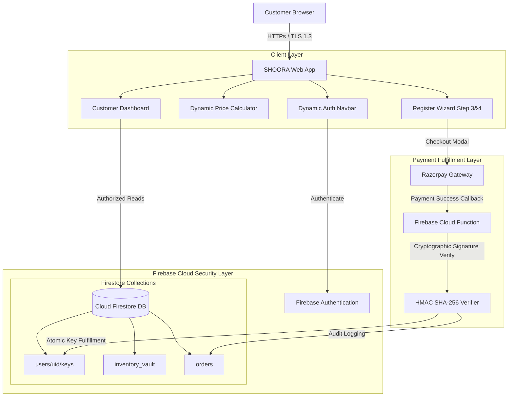

# SHOORA AI — System Architecture & Cloud Topology

This document illustrates the end-to-end system architecture, security isolation boundaries, and data flow topologies for the SHOORA AI platform.

---

## 1. System Topology Diagram

---

## 2. Security Boundaries & Data Isolation

### Client-Side Boundary
- The browser contains **ZERO secret API keys** or admin master credentials.
- All pricing options and selections are validated server-side during checkout order creation.

### Firebase Auth Boundary
- User identity is represented by a signed JWT (`ID Token`).
- Firestore Security Rules inspect `request.auth.uid` on every database access request.

### Payment & Key Allocation Boundary
- Razorpay Secret Key is stored exclusively inside Firebase Cloud Functions environment variables (`functions.config().razorpay.secret`).
- Cryptographic verification prevents client-side price tampering or spoofed payment responses.
